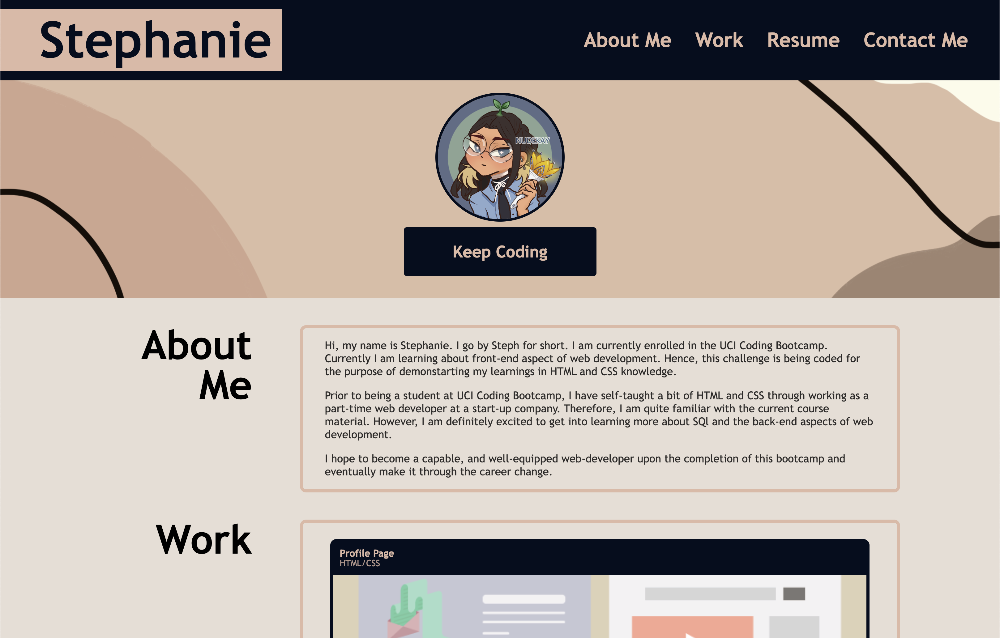
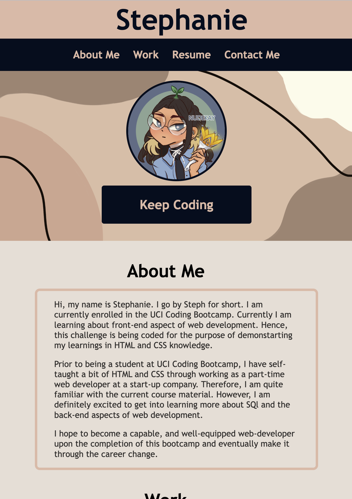
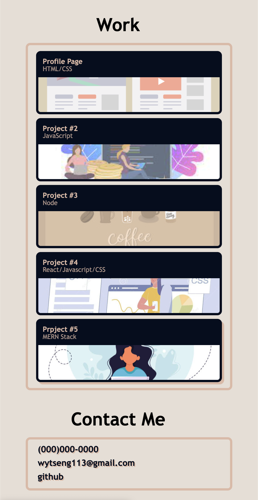

# Stephanie's Professional Portfolio 

## Description

This project presents Stephanie's(me) professional portfolio website. This project utilized HTML and CSS code to create an aesthetically pleasing and resposnive page to. Additionally, this page will be used to document future projects. 

## Installation

N/A

## Usage

You may access the project website through this link: https://wytseng.github.io/professional-portfolio/.

This is how your landing page would look like. 

Upon landing, you will see a header that contains a navigation bar. Clicking on each link will take you to its correspodning section on the page. 

Note❗️: the nav link "Resume" is not yet linked. Link will be updated once a resume is ready.

The work section lists all the project/work I have done, with the first project highlighted. The first project is THIS project, therefore clicking on it will take you to the top of this page. 
More projects will be added in the future, but as of now, all links will bring you to the top of this page.

Last "Contact Me" section contains my (fake) phone number, email, and github page. Clicking on the phone number will directly prompt you to make a call, while the email link will direct you to draft an email to the specified email address. 

Lastly, this page has been coded to be responsive on different veiwport sizes. Below are some images of the resized page.

## Credits

N/A

## License

N/A
